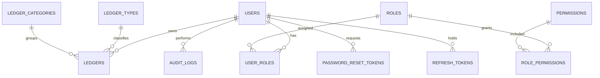

# Enterprise General Ledger Management System Technical Documentation

## 1. Overview

The Enterprise General Ledger Management System (GLMS) is a Java Spring Boot backend for secure user administration, role-based authorization, and ledger record management backed by Oracle Database.

Primary capabilities:

- JWT authentication with access and refresh tokens.
- Secure user lifecycle management for administrators.
- Role-Based Access Control (RBAC) using roles and granular permissions.
- User-owned ledger records with administrator oversight.
- Oracle relational schema with audit columns, constraints, indexes, and seed data.
- Swagger/OpenAPI 3 documentation.
- Enterprise deployment guidance for environment-based configuration.

Reference artifacts:

- Oracle schema and seed data: [oracle-schema.sql](/C:/Users/HP%20USER/Downloads/general-ledger-management-system/general-ledger-management-system/docs/database/oracle-schema.sql)
- OpenAPI specification: [glms-openapi.yaml](/C:/Users/HP%20USER/Downloads/general-ledger-management-system/general-ledger-management-system/docs/openapi/glms-openapi.yaml)
- Maven reference POM: [reference-pom.xml](/C:/Users/HP%20USER/Downloads/general-ledger-management-system/general-ledger-management-system/docs/reference-pom.xml)

## 2. Technology Stack

| Layer | Technology |
| --- | --- |
| Language | Java 21+ |
| Framework | Spring Boot |
| Web | Spring MVC / REST |
| Security | Spring Security, JWT, BCrypt |
| Persistence | Spring Data JPA, Hibernate |
| Database | Oracle Database |
| Build | Maven |
| API Docs | SpringDoc OpenAPI 3 / Swagger UI |
| Boilerplate Reduction | Lombok |
| Validation | Jakarta Validation API |
| Testing | JUnit 5, Spring Boot Test, Spring Security Test |

## 3. Architecture

GLMS uses a layered architecture:

```text
Client
  -> REST Controllers
  -> DTO validation
  -> Services / business rules
  -> Repositories
  -> Oracle Database
```

Security is applied at two levels:

- Request level: public, authenticated, and administrator-only URL rules in `SecurityFilterChain`.
- Method level: permission checks using `@PreAuthorize`, for example `hasAuthority('CREATE_LEDGER')`.

Ledger ownership is enforced in the service layer. A standard user can only read or mutate ledgers where `LEDGERS.OWNER_USER_ID` matches the authenticated user id. Administrators can use separate management methods that require `VIEW_ALL_LEDGERS`, `UPDATE_LEDGER`, or `DELETE_LEDGER`.

## 4. Enterprise Project Structure

Recommended package structure:

```text
src/main/java/com/glms/general_ledger_management_system
  config
    OpenApiConfig.java
    SecurityConfig.java
    DataInitializer.java
    JpaAuditingConfig.java
  controller
    AuthController.java
    AdminUserController.java
    RoleController.java
    PermissionController.java
    LedgerController.java
  dto
    auth
    user
    role
    permission
    ledger
    common
  entity
    User.java
    Role.java
    Permission.java
    Ledger.java
    LedgerType.java
    LedgerCategory.java
    AuditLog.java
    PasswordResetToken.java
    RefreshToken.java
  repository
    UserRepository.java
    RoleRepository.java
    PermissionRepository.java
    LedgerRepository.java
  service
    AuthService.java
    UserService.java
    RoleService.java
    LedgerService.java
    AuditLogService.java
  service/impl
    AuthServiceImpl.java
    UserServiceImpl.java
    RoleServiceImpl.java
    LedgerServiceImpl.java
  security
    JwtAuthenticationFilter.java
    JwtTokenProvider.java
    CustomUserDetailsService.java
    RestAuthenticationEntryPoint.java
    RestAccessDeniedHandler.java
  exception
    GlobalExceptionHandler.java
    ResourceNotFoundException.java
    BusinessRuleException.java
    ForbiddenOperationException.java
  mapper
    UserMapper.java
    LedgerMapper.java
  util
    SecurityUtils.java
    DateTimeUtils.java
  validation
    StrongPassword.java
    StrongPasswordValidator.java
src/main/resources
  application.yml
  db/migration
```

The existing project currently uses packages named `Config`, `DTO`, `Model`, `Repository`, `Security`, and `Service`. For a production enterprise codebase, prefer lowercase package names and split interfaces from implementations as shown above.

## 5. Maven Configuration

Use the Maven reference file in [reference-pom.xml](/C:/Users/HP%20USER/Downloads/general-ledger-management-system/general-ledger-management-system/docs/reference-pom.xml). It includes:

- Spring Web
- Spring Security
- Spring Data JPA
- Validation
- Oracle JDBC Driver
- Lombok
- JJWT
- SpringDoc OpenAPI
- DevTools
- Test dependencies
- Compiler annotation processor configuration

## 6. Configuration Guide

Use environment variables for all secrets. Do not commit JWT secrets, database credentials, SendGrid keys, or Twilio keys.

Example `application.yml`:

```yaml
server:
  port: ${SERVER_PORT:8083}

spring:
  datasource:
    url: ${DB_URL:jdbc:oracle:thin:@localhost:1521/XEPDB1}
    username: ${DB_USERNAME:GLMS_APP}
    password: ${DB_PASSWORD}
    driver-class-name: oracle.jdbc.OracleDriver
  jpa:
    hibernate:
      ddl-auto: validate
    properties:
      hibernate:
        dialect: org.hibernate.dialect.OracleDialect
        format_sql: true

app:
  jwt:
    secret: ${JWT_SECRET}
    access-expiration-ms: ${JWT_ACCESS_EXPIRATION_MS:900000}
    refresh-expiration-ms: ${JWT_REFRESH_EXPIRATION_MS:86400000}
```

Recommended profiles:

- `local`: developer Oracle XE, Swagger enabled.
- `test`: test containers or isolated schema, reduced token TTL.
- `uat`: production-like settings, debug logging disabled.
- `prod`: strict TLS, strong secrets, locked CORS origins, migration validation.

## 7. Database Design

Core tables:

- `USERS`: account identity, status, password hash, audit columns.
- `ROLES`: role catalog, for example `ADMIN` and `USER`.
- `PERMISSIONS`: granular authority catalog.
- `USER_ROLES`: many-to-many user-role mapping.
- `ROLE_PERMISSIONS`: many-to-many role-permission mapping.
- `LEDGER_TYPES`: type catalog, for example `ASSET`, `LIABILITY`, `EQUITY`, `REVENUE`, `EXPENSE`.
- `LEDGER_CATEGORIES`: categorized ledger grouping.
- `LEDGERS`: ledger records owned by users.
- `AUDIT_LOGS`: immutable activity records.
- `PASSWORD_RESET_TOKENS`: one-time password reset tokens.
- `REFRESH_TOKENS`: refresh token lifecycle.

The complete Oracle DDL and sample inserts are in [oracle-schema.sql](/C:/Users/HP%20USER/Downloads/general-ledger-management-system/general-ledger-management-system/docs/database/oracle-schema.sql).

### ERD



## 8. Authentication Flow

1. Client submits `POST /api/auth/login` with username and password.
2. Backend validates credentials using `AuthenticationManager`.
3. Password is verified through `BCryptPasswordEncoder`.
4. Backend checks account status: active, not locked, not deleted.
5. Backend generates a short-lived access token and persisted refresh token.
6. Response returns token, expiry, roles, and permissions.
7. Client sends access token in `Authorization: Bearer <token>`.
8. `JwtAuthenticationFilter` validates signature, expiry, and subject.
9. Security context is populated with user roles and permissions.

Logout should revoke the refresh token and optionally blacklist the current access token until expiry.

Forgot-password flow:

1. Client submits email or username.
2. Backend creates a single-use reset token with short expiry.
3. Backend sends reset link or OTP through email/SMS.
4. Client submits token and new password.
5. Backend validates token, hashes password, invalidates token, and revokes refresh tokens.

## 9. Authorization Flow

Authorization combines roles and permissions:

- `ADMIN`: broad administrative role.
- `USER`: standard application role.
- Permission strings: granular authorities such as `CREATE_LEDGER`, `MANAGE_USERS`, `ASSIGN_ROLES`.

Recommended method-level rules:

```java
@PreAuthorize("hasAuthority('CREATE_LEDGER')")
public LedgerResponse createLedger(LedgerRequest request) { ... }

@PreAuthorize("hasAuthority('MANAGE_USERS')")
public UserResponse createUser(CreateUserRequest request) { ... }

@PreAuthorize("hasAuthority('VIEW_ALL_LEDGERS')")
public Page<LedgerResponse> findAllLedgers(Pageable pageable) { ... }
```

Ledger ownership rule:

```java
if (!currentUser.isAdmin() && !ledger.getOwner().getId().equals(currentUser.getId())) {
    throw new ForbiddenOperationException("You cannot access another user's ledger");
}
```

## 10. Module Implementation Guide

### Authentication and Authorization

Required classes:

- `AuthController`: login, logout, forgot password, reset password, change password, refresh token.
- `AuthService`: validates credentials and coordinates token lifecycle.
- `JwtTokenProvider`: creates and validates JWTs.
- `JwtAuthenticationFilter`: extracts bearer token and populates `SecurityContext`.
- `RefreshTokenRepository`: stores refresh tokens with expiry and revoked state.
- `PasswordResetTokenRepository`: stores reset tokens with expiry and used state.

Key rules:

- Use BCrypt with strength 10-12.
- Never store plain-text passwords.
- Access token TTL should be short, for example 15 minutes.
- Refresh tokens must be revocable and persisted.
- Logout must revoke refresh token records.
- Password reset must invalidate existing refresh tokens.

### User Management

Administrator functions:

- Create user with default status `ACTIVE`.
- Update name, email, phone, status, and profile fields.
- Soft-delete users by setting status `DELETED` where audit history must be preserved.
- Activate and deactivate accounts.
- Assign and remove roles.
- Assign explicit permissions if the business requires user-specific overrides.
- Search by username, email, name, status, role.

Default seed users:

| Username | Password | Role |
| --- | --- | --- |
| `admin` | `Admin@123` | `ADMIN` |
| `user` | `User@123` | `USER` |

The database script uses BCrypt placeholders for password hashes. Generate final hashes using the application encoder or a trusted BCrypt tool during deployment.

### Roles and Permissions

Seed roles:

- `ADMIN`
- `USER`

Seed permissions:

- `CREATE_LEDGER`
- `READ_LEDGER`
- `UPDATE_LEDGER`
- `DELETE_LEDGER`
- `VIEW_ALL_LEDGERS`
- `CREATE_USER`
- `UPDATE_USER`
- `DELETE_USER`
- `MANAGE_USERS`
- `ASSIGN_ROLES`
- `ASSIGN_PERMISSIONS`

Recommended grants:

- `ADMIN`: all permissions.
- `USER`: `CREATE_LEDGER`, `READ_LEDGER`, `UPDATE_LEDGER`, optional `DELETE_LEDGER` for own ledgers only.

### General Ledger Management

Ledger fields should include:

- Ledger number
- Title/name
- Type
- Category
- Description
- Debit amount
- Credit amount
- Currency
- Accounting date
- Status
- Owner user
- Audit columns

Business rules:

- Debit and credit cannot both be negative.
- At least one of debit or credit must be greater than zero.
- Ledger number should be unique.
- Standard users can only access ledgers they own.
- Administrators can view, update, and audit all ledgers.
- Updates should create an audit log entry.

## 11. REST API Specification

The complete OpenAPI document is in [glms-openapi.yaml](/C:/Users/HP%20USER/Downloads/general-ledger-management-system/general-ledger-management-system/docs/openapi/glms-openapi.yaml).

### Authentication APIs

| Method | URL | Description | Auth |
| --- | --- | --- | --- |
| `POST` | `/api/auth/login` | Authenticate username and password | Public |
| `POST` | `/api/auth/logout` | Revoke refresh token/current session | Bearer token |
| `POST` | `/api/auth/forgot-password` | Start password reset | Public |
| `POST` | `/api/auth/reset-password` | Complete password reset | Public |
| `POST` | `/api/auth/change-password` | Change authenticated user's password | Bearer token |
| `POST` | `/api/auth/refresh-token` | Issue new access token | Public or refresh token |
| `GET` | `/api/auth/validate-token` | Validate access token | Bearer token |

### User Management APIs

| Method | URL | Description | Required Permission |
| --- | --- | --- | --- |
| `POST` | `/api/admin/users` | Create user | `CREATE_USER` |
| `GET` | `/api/admin/users` | List/search users | `MANAGE_USERS` |
| `GET` | `/api/admin/users/{id}` | Get user by id | `MANAGE_USERS` |
| `PUT` | `/api/admin/users/{id}` | Update user | `UPDATE_USER` |
| `DELETE` | `/api/admin/users/{id}` | Delete/deactivate user | `DELETE_USER` |
| `PATCH` | `/api/admin/users/{id}/status` | Activate/deactivate user | `MANAGE_USERS` |
| `PUT` | `/api/admin/users/{id}/roles` | Assign roles | `ASSIGN_ROLES` |
| `PUT` | `/api/admin/users/{id}/permissions` | Assign permissions | `ASSIGN_PERMISSIONS` |

### Role and Permission APIs

| Method | URL | Description | Required Permission |
| --- | --- | --- | --- |
| `GET` | `/api/admin/roles` | List roles | `MANAGE_USERS` |
| `POST` | `/api/admin/roles` | Create role | `MANAGE_USERS` |
| `PUT` | `/api/admin/roles/{id}/permissions` | Assign role permissions | `ASSIGN_PERMISSIONS` |
| `GET` | `/api/admin/permissions` | List permissions | `MANAGE_USERS` |

### Ledger APIs

| Method | URL | Description | Required Permission |
| --- | --- | --- | --- |
| `POST` | `/api/ledgers` | Create own ledger | `CREATE_LEDGER` |
| `GET` | `/api/ledgers` | Search own ledgers | `READ_LEDGER` |
| `GET` | `/api/ledgers/{id}` | Get own ledger | `READ_LEDGER` |
| `PUT` | `/api/ledgers/{id}` | Update own ledger | `UPDATE_LEDGER` |
| `DELETE` | `/api/ledgers/{id}` | Delete own ledger | `DELETE_LEDGER` |
| `GET` | `/api/admin/ledgers` | View all ledgers | `VIEW_ALL_LEDGERS` |
| `GET` | `/api/admin/ledgers/{id}/audit` | View ledger audit | `VIEW_ALL_LEDGERS` |

Common status codes:

- `200 OK`: successful read/update/action.
- `201 Created`: resource created.
- `204 No Content`: delete/logout successful.
- `400 Bad Request`: validation failure or malformed request.
- `401 Unauthorized`: missing or invalid token.
- `403 Forbidden`: authenticated but lacks permission or ownership.
- `404 Not Found`: resource not found.
- `409 Conflict`: duplicate username, email, role, or ledger number.
- `500 Internal Server Error`: unhandled server error.

## 12. Swagger/OpenAPI Integration

Add SpringDoc dependency from the reference POM, then configure:

```java
@Configuration
public class OpenApiConfig {
    @Bean
    public OpenAPI glmsOpenAPI() {
        return new OpenAPI()
            .info(new Info()
                .title("Enterprise General Ledger Management System API")
                .version("1.0.0")
                .description("Authentication, user management, RBAC, and ledger APIs"))
            .components(new Components()
                .addSecuritySchemes("bearerAuth",
                    new SecurityScheme()
                        .type(SecurityScheme.Type.HTTP)
                        .scheme("bearer")
                        .bearerFormat("JWT")))
            .addSecurityItem(new SecurityRequirement().addList("bearerAuth"));
    }
}
```

Swagger UI:

- Local: `http://localhost:8083/swagger-ui.html`
- OpenAPI JSON: `http://localhost:8083/v3/api-docs`

Protect Swagger in production or restrict it to trusted networks.

## 13. Security Configuration

Recommended rules:

```java
@Bean
SecurityFilterChain securityFilterChain(HttpSecurity http) throws Exception {
    return http
        .csrf(AbstractHttpConfigurer::disable)
        .sessionManagement(session -> session.sessionCreationPolicy(SessionCreationPolicy.STATELESS))
        .exceptionHandling(ex -> ex
            .authenticationEntryPoint(restAuthenticationEntryPoint)
            .accessDeniedHandler(restAccessDeniedHandler))
        .authorizeHttpRequests(auth -> auth
            .requestMatchers("/api/auth/login", "/api/auth/forgot-password", "/api/auth/reset-password").permitAll()
            .requestMatchers("/v3/api-docs/**", "/swagger-ui/**", "/swagger-ui.html").permitAll()
            .requestMatchers("/api/admin/**").hasRole("ADMIN")
            .anyRequest().authenticated())
        .addFilterBefore(jwtAuthenticationFilter, UsernamePasswordAuthenticationFilter.class)
        .build();
}
```

Use `@EnableMethodSecurity` and check permissions at service methods. URL rules are coarse-grained; method checks are the authoritative business guard.

## 14. Validation Rules

Examples:

- Username: required, 3-50 characters, unique, alphanumeric plus `_`, `.`, `-`.
- Email: required, valid format, unique.
- Password: required, minimum 8 characters, uppercase, lowercase, number, special character.
- Ledger title: required, maximum 150 characters.
- Ledger amount: non-negative, precision suitable for accounting.
- Currency: required ISO 4217 code, 3 uppercase letters.
- Accounting date: required, not unreasonably future-dated.
- Role/permission names: uppercase snake case, unique.

## 15. Exception Handling

Use a centralized `@RestControllerAdvice` that returns a consistent error response:

```json
{
  "timestamp": "2026-07-28T10:00:00Z",
  "status": 400,
  "error": "Bad Request",
  "message": "Validation failed",
  "path": "/api/ledgers",
  "details": [
    {
      "field": "title",
      "message": "must not be blank"
    }
  ]
}
```

Map exceptions:

- `MethodArgumentNotValidException` -> `400`
- `BadCredentialsException` -> `401`
- `AccessDeniedException` -> `403`
- `ResourceNotFoundException` -> `404`
- `DuplicateResourceException` -> `409`
- unhandled exceptions -> `500`

## 16. Audit Logging

Audit log fields:

- Actor user id
- Action
- Entity type
- Entity id
- Old value JSON
- New value JSON
- IP address
- User agent
- Timestamp

Events to audit:

- Login success/failure
- Logout
- Password reset/change
- User create/update/delete/status change
- Role and permission assignments
- Ledger create/update/delete
- Administrator ledger access

Audit logs should be append-only. Do not expose update/delete APIs for audit records.

## 17. Installation Guide

Prerequisites:

- Java 21+
- Maven 3.9+
- Oracle Database 19c/21c/23ai or Oracle XE
- Oracle user/schema with DDL privileges for setup

Steps:

```powershell
cd C:\Users\HP USER\Downloads\general-ledger-management-system\general-ledger-management-system
.\mvnw.cmd clean package
```

Create Oracle schema:

```sql
CREATE USER GLMS_APP IDENTIFIED BY "change_me";
GRANT CONNECT, RESOURCE TO GLMS_APP;
ALTER USER GLMS_APP QUOTA UNLIMITED ON USERS;
```

Run `docs/database/oracle-schema.sql` as `GLMS_APP`.

Set environment variables:

```powershell
$env:DB_URL="jdbc:oracle:thin:@localhost:1521/XEPDB1"
$env:DB_USERNAME="GLMS_APP"
$env:DB_PASSWORD="change_me"
$env:JWT_SECRET="replace-with-at-least-256-bit-secret"
```

Start application:

```powershell
.\mvnw.cmd spring-boot:run
```

## 18. Deployment Guide

Recommended production deployment:

1. Build immutable JAR using `mvn clean package`.
2. Run DB migrations through Liquibase or Flyway before application rollout.
3. Inject secrets using a secret manager, not files committed to source control.
4. Run with `SPRING_PROFILES_ACTIVE=prod`.
5. Put application behind a TLS-terminating reverse proxy or load balancer.
6. Enable structured logs and centralized monitoring.
7. Configure database connection pool limits.
8. Configure backup, restore, and audit log retention.

JAR execution:

```powershell
java -jar target/general-ledger-management-system-0.0.1-SNAPSHOT.jar
```

## 19. Testing Guide

Recommended tests:

- Unit tests for services and validators.
- Repository tests for query behavior.
- Controller tests with `MockMvc`.
- Security tests for `401`, `403`, ownership enforcement, and permission grants.
- Integration tests against Oracle-compatible test schema.
- Migration tests for DDL scripts.

Important scenarios:

- Standard user cannot view another user's ledger.
- Standard user cannot edit another user's ledger.
- Admin can view all ledgers.
- Disabled user cannot login.
- Expired reset token is rejected.
- Revoked refresh token cannot be reused.
- Duplicate username/email/ledger number returns `409`.

Run tests:

```powershell
.\mvnw.cmd test
```

## 20. Troubleshooting

| Symptom | Likely Cause | Fix |
| --- | --- | --- |
| `ORA-01017` | Invalid DB username/password | Check `DB_USERNAME` and `DB_PASSWORD` |
| `ORA-12514` | Wrong Oracle service name | Verify `DB_URL` service/SID |
| `401 Unauthorized` | Missing/expired JWT | Login again or refresh token |
| `403 Forbidden` | Missing permission or ownership violation | Check role/permission mappings |
| Swagger returns 404 | SpringDoc dependency missing | Add `springdoc-openapi-starter-webmvc-ui` |
| JPA validation fails on startup | Schema and entities differ | Align DDL, entity annotations, and naming strategy |
| Password login fails for seed users | BCrypt hash does not match sample password | Regenerate BCrypt hashes |

## 21. Best Practices

- Keep database schema changes versioned.
- Use `ddl-auto=validate` outside local development.
- Store all secrets outside source control.
- Use short-lived access tokens and revocable refresh tokens.
- Prefer permissions for business checks and roles for grouping.
- Enforce ownership in services, not only controllers.
- Return consistent error responses.
- Avoid exposing internal exception messages.
- Log security events without logging passwords or tokens.
- Use pagination for list/search endpoints.
- Use optimistic locking on financial records where concurrent updates are possible.
- Consider soft delete for ledger records when auditability matters.

## 22. Implementation Notes Against Current Workspace

The current workspace already contains early versions of:

- `AuthService`
- `JwtAuthenticationFilter`
- `JwtUtils`
- `SecurityConfig`
- user, role, permission, audit, refresh token, password reset, and OTP models

The requested enterprise GLMS still needs full ledger entity/repository/service/controller implementation, Oracle-specific DDL alignment, Swagger integration, and stronger production configuration hygiene.

